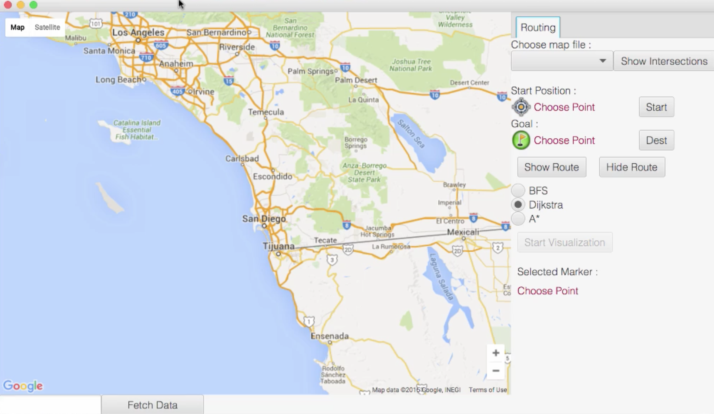
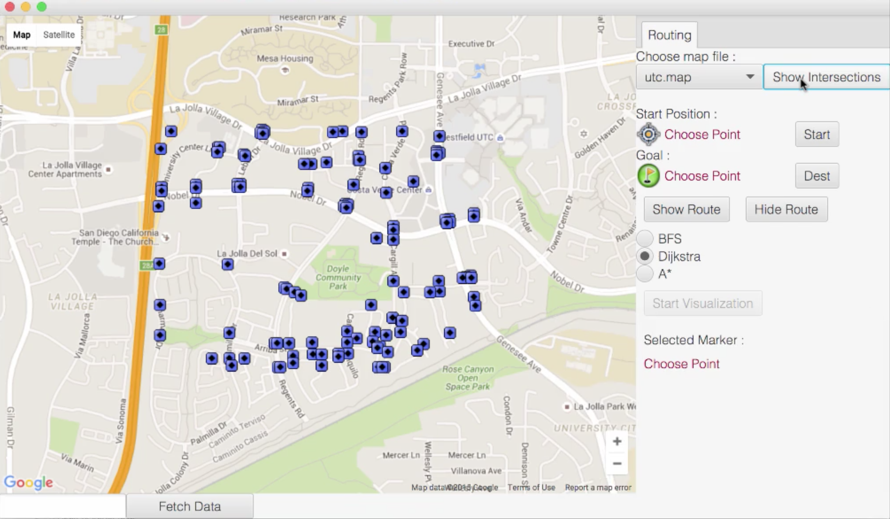
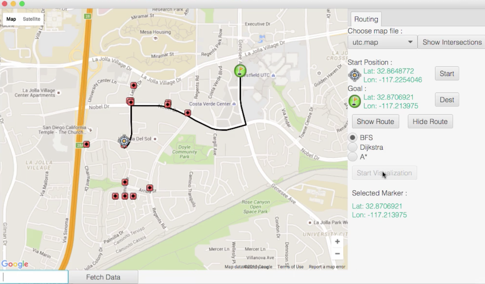

# UCSD_Graph
The repo is to implement a toy "Google Map" and trying to find the shortest path between two points using BFS/ Dijkstra/ A* Algorithms.

GUI of the project:

## FEATURE

The points can be read from a text file and then marked on the google map.

Different algorithms can be chosen from to get the shortest path from the user's selected start point to the end point.

